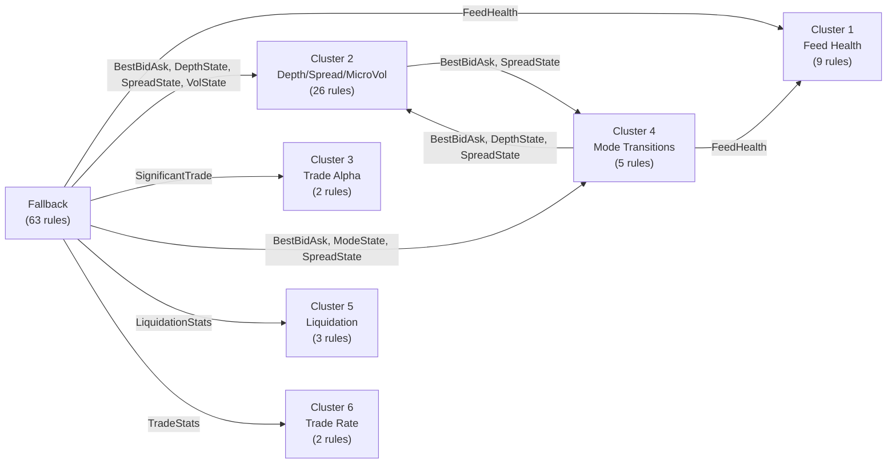

# Cluster Composition Analysis (No God Objects)

> **Scope:** Focus on `taxonomy_no_god_objects.drl` — all rules referencing `FeedHealth` or `ModeState` are excluded.  
> **Source:** Infomap `.ftree` file (6 clusters, 47 total rules from runtime trace).

---

## God Object Rules in the .ftree

The following 12 rules from the ftree file reference `FeedHealth` or `ModeState` and are **excluded** from this analysis:

| Rule | God Object | Original Cluster |
|------|-----------|-----------------|
| `B12_TradeActiveBookSilent` | FeedHealth | 1 |
| `B13_BookActiveTradeSilent` | FeedHealth | 1 |
| `B14_StaleMark` | FeedHealth | 1 |
| `UPD_LastSeen_Trade` | FeedHealth | 1 |
| `UPD_LastSeen_Depth` | FeedHealth | 1 |
| `UPD_LastSeen_Mark` | FeedHealth | 1 |
| `D32_TradesWhileBookStale` | FeedHealth | 1 |
| `C25_BookAgeStale` | FeedHealth | 1 |
| `G59_MarkStaleButMarketActive` | FeedHealth | 1 |
| `I68_EnterThrottled_OnDegraded` | ModeState + FeedHealth | 4 |
| `I69_EnterSafe_OnLiquidityStress` | ModeState | 4 |
| `RECOVERY_ExitThrottledToNormal` | ModeState + FeedHealth | 4 |

**Total excluded: 12 rules → Remaining in ftree: 35 rules**

---

## Cluster Breakdown (After God Object Removal)

### Cluster 1 — Feed Health & Staleness Detection
**Original: 9 rules → After filtering: 0 rules**

| # | Rule Name | Status |
|---|-----------|--------|
| ~~1~~ | ~~B12_TradeActiveBookSilent~~ | ❌ FeedHealth |
| ~~2~~ | ~~UPD_LastSeen_Trade~~ | ❌ FeedHealth |
| ~~3~~ | ~~D32_TradesWhileBookStale~~ | ❌ FeedHealth |
| ~~4~~ | ~~UPD_LastSeen_Depth~~ | ❌ FeedHealth |
| ~~5~~ | ~~B13_BookActiveTradeSilent~~ | ❌ FeedHealth |
| ~~6~~ | ~~C25_BookAgeStale~~ | ❌ FeedHealth |
| ~~7~~ | ~~B14_StaleMark~~ | ❌ FeedHealth |
| ~~8~~ | ~~UPD_LastSeen_Mark~~ | ❌ FeedHealth |
| ~~9~~ | ~~G59_MarkStaleButMarketActive~~ | ❌ FeedHealth |

> [!WARNING]
> Cluster 1 is **entirely eliminated** — every single rule depends on `FeedHealth`.

---

### Cluster 2 — Depth, Spread & Micro-Volatility
**Original: 26 rules → After filtering: 26 rules (no god object dependencies)**

| # | Rule Name | Sub-group |
|---|-----------|-----------|
| 1 | `K76_Beta_SpreadVelocity` | 2:1 |
| 2 | `DERIVE_BestBidAsk_Update` | 2:1 |
| 3 | `K75_Alpha_DepthUpdate` | 2:1 |
| 4 | `CLEANUP_RetractDepthUpdateTick` | 2:1 |
| 5 | `C21_TopJumpNoTrades` | 2:1 |
| 6 | `K77_Beta_AssessMicroVolRisk` | 2:2 |
| 7 | `K78_Beta_EmitMicroVolSignal` | 2:2 |
| 8 | `E34_DepthTiering` | 2:2 |
| 9 | `BOOTSTRAP_SpreadVelocityState` | 2:2 |
| 10 | `BOOTSTRAP_MicroVolatilityRisk` | 2:2 |
| 11 | `E35_DepthCollapse` | 2:2 |
| 12 | `E33_SpreadComputeAndTier_Update` | 2:3 |
| 13 | `E41_LiquidityStressCombine` | 2:3 |
| 14 | `E36_SpreadBlowout` | 2:3 |
| 15 | `L81_Beta_AssessDislocation` | 2:4:1 |
| 16 | `L82_Beta_EmitDislocationSignal` | 2:4:1 |
| 17 | `F43_VolTiering` | 2:4:1 |
| 18 | `BOOTSTRAP_DislocationEscalation` | 2:4:1 |
| 19 | `L80_Beta_MarkDivergence` | 2:4:2 |
| 20 | `L79_Alpha_MarkPriceUpdate` | 2:4:2 |
| 21 | `CLEANUP_RetractMarkPriceTick` | 2:4:2 |
| 22 | `BOOTSTRAP_MarkDivergencePulsar` | 2:4:2 |
| 23 | `BOOTSTRAP_VolState` | 2:4:3 |
| 24 | `F52_RegimeNormalizationEligibility` | 2:4:3 |
| 25 | `BOOTSTRAP_DepthState` | 2:5 |
| 26 | `E37_PersistentThinLiquidity` | 2:5 |

> [!NOTE]
> This is the **largest and most complex cluster** — contains the full depth/spread pipeline, micro-volatility chain (K75→K78), and the mark divergence chain (L79→L82). **Zero god object dependencies.**

---

### Cluster 3 — Trade Alpha (Significant Trade Detection)
**Original: 2 rules → After filtering: 2 rules**

| # | Rule Name |
|---|-----------|
| 1 | `CLEANUP_RetractSignificantTrade` |
| 2 | `J71_Alpha_SignificantTrade` |

> [!NOTE]
> Fully self-contained trade detection micro-pipeline. No external state dependencies.

---

### Cluster 4 — Mode Transitions & Recovery
**Original: 5 rules → After filtering: 2 rules**

| # | Rule Name | Status |
|---|-----------|--------|
| 1 | `E33_SpreadComputeAndTier_New` | ✅ Kept |
| 2 | ~~`I68_EnterThrottled_OnDegraded`~~ | ❌ ModeState + FeedHealth |
| 3 | ~~`I69_EnterSafe_OnLiquidityStress`~~ | ❌ ModeState |
| 4 | ~~`RECOVERY_ExitThrottledToNormal`~~ | ❌ ModeState + FeedHealth |
| 5 | `DERIVE_BestBidAsk_New` | ✅ Kept |

**Remaining rules:** `E33_SpreadComputeAndTier_New`, `DERIVE_BestBidAsk_New`

> [!IMPORTANT]
> These 2 remaining rules are "New" variants (insert when singleton doesn't exist). They only fire once per symbol at bootstrap. After that, the `_Update` variants in Cluster 2 take over.

---

### Cluster 5 — Liquidation Monitoring
**Original: 3 rules → After filtering: 3 rules**

| # | Rule Name |
|---|-----------|
| 1 | `BOOTSTRAP_LiquidationStats` |
| 2 | `H61_LiqTiering` |
| 3 | `H67_CascadeCooldownEligibility` |

> [!NOTE]
> Fully self-contained. No event ingestion — operates on internal `LiquidationStats` state only.

---

### Cluster 6 — Trade Rate Monitoring
**Original: 2 rules → After filtering: 2 rules**

| # | Rule Name |
|---|-----------|
| 1 | `BOOTSTRAP_TradeStats` |
| 2 | `D30_TradeRateTiering` |

> [!NOTE]
> Fully self-contained. Operates on `TradeStats` state only.

---

## Summary Table

| Cluster | Name | Original Rules | God Object Rules Removed | **Remaining Rules** |
|---------|------|:--------------:|:------------------------:|:-------------------:|
| **1** | Feed Health & Staleness | 9 | 9 | **0** |
| **2** | Depth/Spread/MicroVol | 26 | 0 | **26** |
| **3** | Trade Alpha | 2 | 0 | **2** |
| **4** | Mode Transitions | 5 | 3 | **2** |
| **5** | Liquidation | 3 | 0 | **3** |
| **6** | Trade Rate | 2 | 0 | **2** |
| **Total** | | **47** | **12** | **35** |

---

## Rules NOT in Any Cluster (Fallback Candidates)

The `.ftree` only covers **47 of the 83 rules** in `taxonomy_no_god_objects.drl`. The remaining **48 rules** (83 - 35 remaining ftree rules) are not assigned to any Infomap cluster and would go into the Fallback session.

These include:
- **Section A:** All ingestion/validation rules (A01–A08)
- **Section B:** `B10_ReconnectStorm`, `B16_LateEventRateHigh`
- **Section C:** `C19_CrossedBook`, `C20_NegativeOrZeroSpreadPersistent`, `C22–C24` (disabled)
- **Section D:** `D27_TradePriceOutOfBandVsMid`, `D28_TradeSizeOutlier`, `D31_LargeTradeCluster` (disabled)
- **Section E:** `E38_Imbalance*`, `E39`, `E40`, `E42_MarketImpactRiskCombine`
- **Section F:** `F44–F51` (volatility signals)
- **Section G:** `G53–G57`, `G60` (mark-index divergence)
- **Section H:** `H62–H66` (liquidation signals)
- **Section J:** `J72–J74` (trade sweep impact chain)
- **Bootstraps:** `BOOTSTRAP_TradeSweepImpact`, `BOOTSTRAP_MicrostructureStress`
- **Cleanup:** `CLEANUP_RetractProcessedEvent`

---

## Key Observations

1. **Cluster 1 is dead** — entirely composed of `FeedHealth` god object rules. In a no-god-object scenario, this cluster simply doesn't exist.

2. **Cluster 2 dominates** — with 26 rules, it contains 74% of all remaining ftree rules. It is the core computational engine (depth/spread/vol/dislocation pipelines).

3. **Cluster 4 is nearly dead** — only 2 "bootstrap insert" rules survive, and these fire only once per symbol. Effectively negligible at runtime.

4. **Clusters 3, 5, 6 are tiny but clean** — fully self-contained micro-pipelines with no cross-dependencies.

5. **Effective topology:** In practice, you have **1 large cluster (26 rules) + 3 tiny clusters (2+3+2 = 7 rules) + a large fallback (~48 rules)**.

---

## Cross-Cluster Dependency Analysis (Original taxonomy.drl, 110 Rules)

> **Method:** Used `DrlRuleParser` (Drools AST-based parser) to extract LHS inputs and RHS outputs for each rule, then computed fact-type intersections between cluster output sets and input sets.
>
> **Source:** [CrossClusterDependencyAnalyzer.java](file:///home/maheshdila/mahesh/research/incubator-kie-benchmarks/drools-benchmarks-parent/drools-benchmarks-binance-cep/src/main/java/org/kie/benchmark/binance/parallel/CrossClusterDependencyAnalyzer.java)

### Per-Cluster Fact Type I/O Summary

| Cluster | Inputs (LHS) | Outputs (RHS) |
|---------|---------------|----------------|
| **1** | FeedHealth, MarketEvent, RiskConfig | **FeedHealth**, RiskSignal |
| **2** | BestBidAsk, DepthState, DepthUpdateTick, DislocationEscalation, MarkDivergencePulsar, MarkPriceTick, MarketEvent, MicroVolatilityRisk, RiskConfig, SpreadState, SpreadVelocityState, VolState | **BestBidAsk**, **DepthState**, DepthUpdateTick, DislocationEscalation, MarkDivergencePulsar, MarkPriceTick, MicroVolatilityRisk, RiskSignal, **SpreadState**, SpreadVelocityState, **VolState** |
| **3** | MarketEvent, SignificantTrade | **SignificantTrade** |
| **4** | BestBidAsk, DepthState, FeedHealth, MarketEvent, ModeState, RiskConfig, SpreadState | **BestBidAsk**, **ModeState**, **SpreadState** |
| **5** | LiquidationStats, RiskConfig | **LiquidationStats**, RiskSignal |
| **6** | RiskConfig, TradeStats | **TradeStats** |

### Cross-Cluster Dependencies



### Detailed Cross-Cluster Dependency Breakdown

#### Cluster 2 ← Cluster 4 (via `BestBidAsk`, `SpreadState`)

| Shared Fact | Producer Rule (Cluster 4) | Consumer Rules (Cluster 2) |
|-------------|---------------------------|----------------------------|
| `BestBidAsk` | `DERIVE_BestBidAsk_New` | `K76_Beta_SpreadVelocity`, `DERIVE_BestBidAsk_Update`, `C21_TopJumpNoTrades`, `E33_SpreadComputeAndTier_Update`, `L80_Beta_MarkDivergence` |
| `SpreadState` | `E33_SpreadComputeAndTier_New` | `E33_SpreadComputeAndTier_Update`, `E41_LiquidityStressCombine`, `E36_SpreadBlowout` |

> [!NOTE]
> Both `DERIVE_BestBidAsk_New` and `E33_SpreadComputeAndTier_New` are **one-time bootstrap insert** rules. They fire once per symbol when the singleton doesn't exist. After that, the `_Update` variants in Cluster 2 take over. This dependency is only at initialization time.

#### Cluster 4 ← Cluster 1 (via `FeedHealth`)

| Shared Fact | Producer Rules (Cluster 1) | Consumer Rules (Cluster 4) |
|-------------|----------------------------|----------------------------|
| `FeedHealth` | `B12_TradeActiveBookSilent`, `UPD_LastSeen_Trade`, `UPD_LastSeen_Depth`, `B13_BookActiveTradeSilent`, `B14_StaleMark`, `UPD_LastSeen_Mark` | `I68_EnterThrottled_OnDegraded`, `RECOVERY_ExitThrottledToNormal` |

> [!CAUTION]
> This is the **god object dependency**. Cluster 4's mode transition rules depend on `FeedHealth.status` produced by Cluster 1's update rules.

#### Cluster 4 ← Cluster 2 (via `BestBidAsk`, `DepthState`, `SpreadState`)

| Shared Fact | Producer Rules (Cluster 2) | Consumer Rules (Cluster 4) |
|-------------|---------------------------|----------------------------|
| `BestBidAsk` | `DERIVE_BestBidAsk_Update` | `E33_SpreadComputeAndTier_New`, `DERIVE_BestBidAsk_New` |
| `DepthState` | `E34_DepthTiering`, `BOOTSTRAP_DepthState` | `I69_EnterSafe_OnLiquidityStress` |
| `SpreadState` | `E33_SpreadComputeAndTier_Update` | `E33_SpreadComputeAndTier_New`, `I69_EnterSafe_OnLiquidityStress` |

#### Fallback ← All Clusters 

| Source | Shared Facts |
|--------|-------------|
| Fallback ← Cluster 1 | `FeedHealth` |
| Fallback ← Cluster 2 | `BestBidAsk`, `DepthState`, `SpreadState`, `VolState` |
| Fallback ← Cluster 3 | `SignificantTrade` |
| Fallback ← Cluster 4 | `BestBidAsk`, `ModeState`, `SpreadState` |
| Fallback ← Cluster 5 | `LiquidationStats` |
| Fallback ← Cluster 6 | `TradeStats` |

> [!WARNING]
> The Fallback depends on **every single cluster's output**. This is why in previous experiments, the Fallback suffered 99.2% RiskSignal data loss — it never received the intermediate facts produced by the other sessions.

### Independence Matrix (Clusters 2, 3, 5, 6 — No God Objects)

When we remove god object rules (Cluster 1 eliminated, Cluster 4 reduced to 2 bootstrap rules):

| | Cluster 2 | Cluster 3 | Cluster 5 | Cluster 6 |
|---|:---------:|:---------:|:---------:|:---------:|
| **Cluster 2** | — | ✅ Independent | ✅ Independent | ✅ Independent |
| **Cluster 3** | ✅ Independent | — | ✅ Independent | ✅ Independent |
| **Cluster 5** | ✅ Independent | ✅ Independent | — | ✅ Independent |
| **Cluster 6** | ✅ Independent | ✅ Independent | ✅ Independent | — |

> [!IMPORTANT]
> **Clusters 2, 3, 5, and 6 are fully independent** of each other — they share zero fact types in their inputs/outputs. This confirms that parallel execution of these 4 clusters is safe with zero cross-session state concerns.

### Proposed Hybrid Architecture (With God Objects in Dedicated Session)

```
┌─────────────────────────────────────┐
│  God Object Session (Single Rete)   │
│  Cluster 1 (9 rules) + Cluster 4   │
│  mode rules (3 rules) = 12 rules    │
│  Facts: FeedHealth, ModeState       │
│  ← receives ALL events             │
└─────────────────────────────────────┘
         ║            ║           ║           ║
  ┌──────────────┐ ┌──────────┐ ┌──────────┐ ┌──────────┐
  │ Cluster 2    │ │Cluster 3 │ │Cluster 5 │ │Cluster 6 │
  │ 26 rules     │ │ 2 rules  │ │ 3 rules  │ │ 2 rules  │
  │+BBA_New      │ │Trade α   │ │Liq Mon   │ │Trade Rate│
  │+Spread_New   │ │          │ │          │ │          │
  │ = 28 rules   │ │          │ │          │ │          │
  └──────────────┘ └──────────┘ └──────────┘ └──────────┘
  ✅ Independent   ✅ Indep.    ✅ Indep.    ✅ Indep.
```

The 2 surviving Cluster 4 rules (`DERIVE_BestBidAsk_New`, `E33_SpreadComputeAndTier_New`) can be merged into Cluster 2 since they are one-time bootstrap inserts for facts that Cluster 2 subsequently manages via `_Update` variants.
