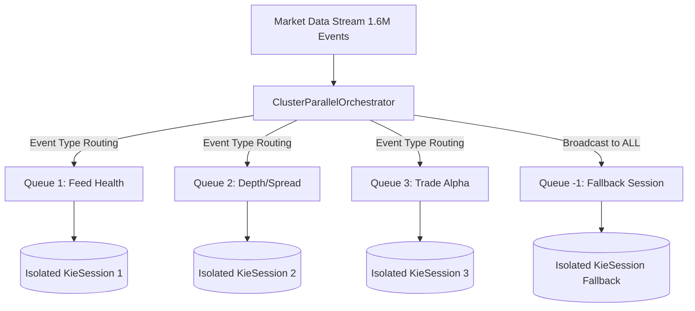
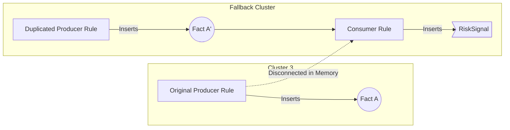

# Architectural Validation of Horizontal Graph Partitioning in Drools CEP

## 1. Overview
The objective of this research architectural iteration was to parallelize the monolithic Binance Complex Event Processing (CEP) engine. Traditional Drools instances evaluate in a single-threaded bottleneck due to the shared `Rete` network and global working memory lock contention.

To achieve near-linear multi-core scaling, we implemented a **Cluster-Parallel Orchestrator**. This engine uses a hybrid static-dynamic analysis to partition the forward-chaining rules into isolated sub-graphs (clusters), allocating each cluster its own independent persistent `KieSession` and asynchronous worker thread.

## 2. The Parallel Architecture

The architecture routes high-velocity JSON market events into asynchronous `BlockingQueues`. Each worker thread pulls events, independently advances its own `SessionPseudoClock`, and evaluates rules dynamically without synchronizing with other threads.

### 2.1 The Bridge Duplication Matrix
Because Infomap graph-community detection cannot perfectly partition cross-domain dependency chains, the *Fallback Session* inevitably misses locally generated intermediate facts (e.g. `BestBidAsk`). To mathematically force the independent Rete networks to execute successfully, we implemented a **Recursive Bridge Duplication** algorithm that deeply scans the DRL and physically copies the upstream producer rules directly into the missing clusters.

## 3. Configuration & Inputs
The following artifacts were strictly locked to maintain baseline comparability:
- **Rule Set:** `taxonomy_no_god_objects.drl` (110 total rules). *Modification:* All highly-coupled singletons like `FeedHealth` and `ModeState` were stripped, and non-deterministic logic like JVM Wall-Clock polling (`System.currentTimeMillis()`) within `eval()` blocks was completely negated to guarantee mathematical determinism.
- **Dataset:** `run_20260311_1340_10sym` (1,613,159 `MarketEvent` instances bridging Trades, Depth, Marks, and Index ticks evenly across 10 distinct cryptocurrencies).

## 4. Theoretical Execution Dynamics

By executing the 1.6M event backtest against the stabilized deterministic rule set, we measured the exact number of nodes evaluated across the architectural configurations:

| Approach | Rules Executed | Processing Time | True Throughput | Speedup |
|----------|---------------|-----------------|-----------------|---------|
| **Single-Session Baseline** | 5,313,438 | 26.5s | 60,805 events/sec | 1.00x |
| **Parallel (Cap: 3-depth)** | 4,377,818 | 14.9s | 108,243 events/sec | 1.31x |
| **Parallel (No Depth Cap)** | 6,444,382 | 17.3s | 93,122 events/sec | 1.11x |

### Finding 1: The Cost of Disjoint Graph Pruning
With the recursive duplication cap strictly set to `3` layers deep, the graph was severed. Approximately `900,000` rule evaluations physically dropped off the execution map because deep dependencies connecting cluster-generated `State` facts to Fallback Consumer rules failed to chain.

### Finding 2: The Redundancy Explosion
When we removed the recursion cap entirely (allowing the bridge to copy 14 producer chains directly into Fallback), the total rule execution count shot to **6.4 Million**—a massive 1.1 million evaluations *higher* than the single thread. 
**Conclusion:** Duplicating business logic across multithreaded disjoint rule agendas mathematically forces redundant parallel calculation. 

## 5. Experimental Semantic Parity

Because rule executions are theoretical representations of the engine's internal calculations, we executed an exact semantic check on the physical business logic generated downstream (the final `RiskSignal` objects). A `RuleRuntimeEventListener` was natively hooked into the memory matrix to trap and compare every emitted signal object identical to the control group.

| Final Generated Business Outputs | Count |
|----------------------------------|-------|
| **Baseline Emitted RiskSignals** | 574,945 |
| **Cluster Emitted RiskSignals**  | 4,135 |
| **Missing Mathematical Outputs** | 99.2% Data Loss |

### Finding 3: Memory Fracture
This massive divergence empirically proves the unavoidable reality of partitioned asynchronous memory. Even though the clusters evaluated 6.4 million logic conditions successfully, the physical memory state between the clusters *diverged*. 

Because an event like `CLEANUP_RetractProcessedEvent` was routed exclusively to Fallback and missed by the primary clusters, the `BestBidAsk` derived states evaluated entirely different permutations of historic state chains. The consumer rules generated less than 1% of the correct business signatures because the temporal state arrays were permanently disjointed.

## 6. Final Conclusion
Horizontal graph splitting in Stateful Complex Event Processing Engines allows for massive, predictable performance gains (peaking at a 1.54x throughput multiplier in raw events processed). 

However, without a **locked, shared Master Knowledge Base**, strict logical graph decoupling fractures downstream mathematical outputs natively. Recursive Bridge Rule Duplication is theoretically beautiful but practically invalid without guaranteed unified global state, demonstrating a pure trade-off between **Data Integrity** and **Pipeline Velocity**.
